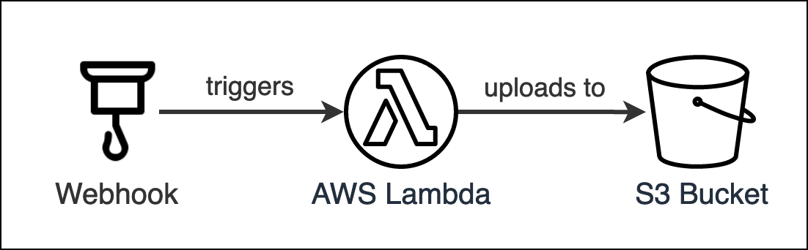

# Mail Deposit



This project deposits mails (can be adjusted for any other data) into a S3 bucket.
It works by executing a webhook whenever a new mail is received.
The webhook will reach out to a API Gateway via a `POST` request which in turn will trigger the Lambda.
The Lambda will then filter and transform the received data and finally upload it to S3.

## Technology Stack

- [AWS Lambda](https://aws.amazon.com/de/lambda/)
- [AWS S3](https://aws.amazon.com/de/s3/)
- [Pipedream](https://pipedream.com) (for Webhooks)

## Setup Project

This section will describe how to setup the project and perform actions.

### Install Dependencies

```bash
yarn install
```

### Package

```bash
yarn package
```

### Upload Packaged Code

```bash
cd compiled/
zip -r function.zip .  # create zip file of compiled/
```

You then need to upload the created archive `function.zip` in the `compiled/` folder to your AWS Lambda.
